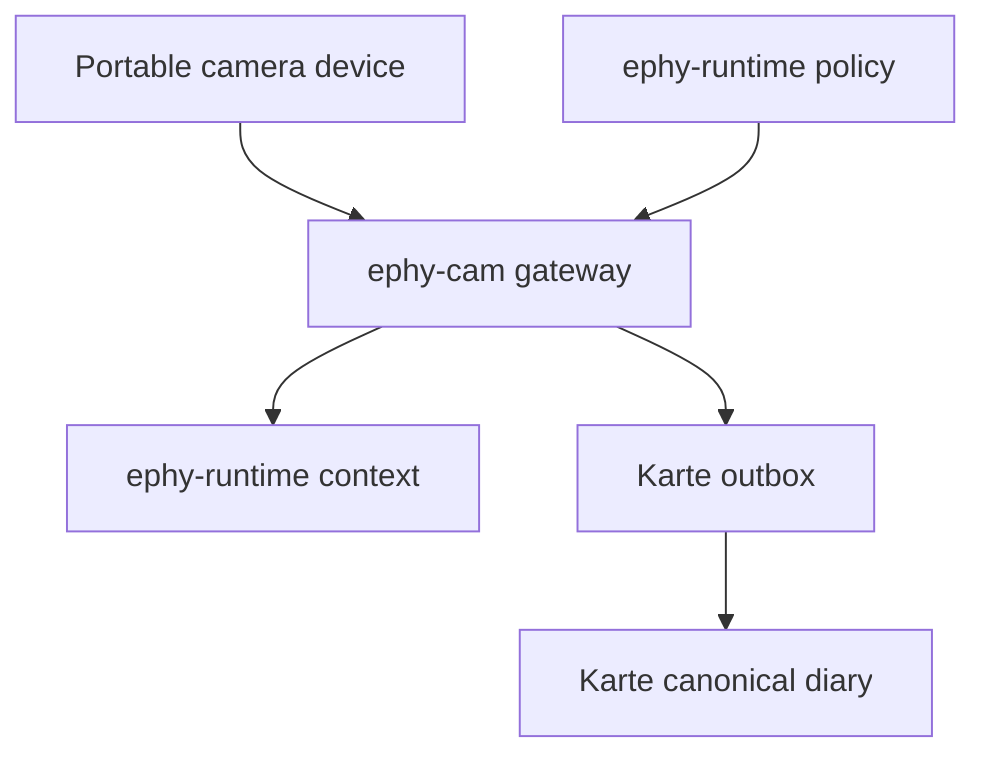
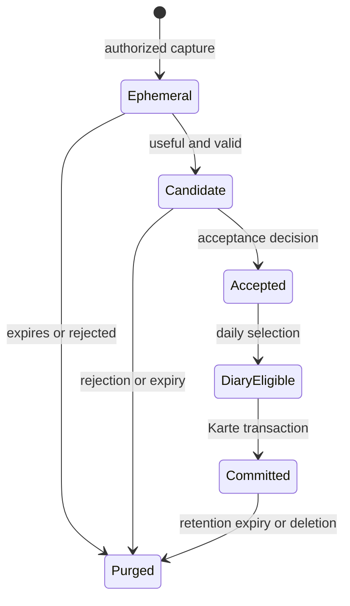

# Ephy camera context architecture

## Purpose

This document defines the cross-repository design for a portable `ephy-cam` that can capture automatically inside user-authorized places and time windows，provide images or short-lived visual observations to Ephy，and add accepted photos to a Karte daily diary．It refines the reference architecture without moving device，runtime，or Karte implementation into this meta repository．

## Decision status

| Topic | Status | Decision |
| --- | --- | --- |
| Form factor | Accepted | The camera is portable rather than assigned to one fixed room． |
| Automatic capture | Accepted | Automatic capture is permitted only when both an authorized place and an authorized time window are satisfied． |
| Diary finalization | Accepted | A daily diary may be finalized automatically from photos whose lifecycle state is already `accepted`． |
| Place evidence | Proposed | A short-lived permit should be issued from manual arming or trusted local evidence; SSID or GPS alone is insufficient． |
| Bystander handling | Proposed | Automatic capture should pause when another person may be present unless the active policy explicitly permits that situation． |
| Capture indicator | Required，implementation undecided | Every automatic capture must have a visible hardware indicator whose operation can be verified independently of the image pipeline． |

The accepted decisions are recorded in [ADR-0001](adr/0001-portable-camera-authorization.md) and [ADR-0002](adr/0002-accepted-photo-diary-finalization.md)．The proposed items are defaults for implementation discussion，not claims about current behavior．

## Current implementation

`ephy-cam` currently contains a hardware-validated XIAO ESP32S3 Sense reference．An operator explicitly requests one capture over USB CDC; the device returns a JPEG; the host validates the image and writes media plus `CaptureSource` and `MediaEnvelope` v1 documents to temporary，Git-external staging．Preview is memory-only．

The current reference does not implement Wi-Fi transport，automatic capture，continuous recording，microSD spooling，retention policy，`ephy-runtime` ingestion，or Karte writes．`ephy-physical-ci` installs validation packages and invokes the external reference，but does not own firmware or the production camera service．

## Target outcome

- Ephy can request a photo as image input and can receive a minimized，expiring visual observation．
- Ephy can propose a short utterance after a useful，authorized observation．
- Automatic capture is fail-closed outside an effective `CapturePermit`．
- Captured media follows an explicit lifecycle，and capture alone never makes a photo permanent．
- Only accepted media can become a Karte diary asset．
- The daily diary update is idempotent and transactional even when it is configured for automatic finalization．
- Raw images，precise place history，credentials，and instance policy remain outside normal Git．

## Non-goals

- Continuous video recording or covert capture．
- Inferring health，emotion，personality，identity，or intent from an image．
- Giving `ephy-physical-ci` production scheduling or retention responsibility．
- Allowing the camera device to read all of `ephy-private` or the Karte data directory．
- Treating successful capture as consent to preserve，publish，or add the photo to a diary．

## Responsibility boundaries

| Owner | Responsibilities | Must not own |
| --- | --- | --- |
| Camera device | Sensor configuration，indicator control，one-shot capture，device identity，bounded buffering． | Long-lived private policy，diary generation，model inference，Karte credentials． |
| `ephy-cam` | Device adapter，capture request validation，permit enforcement at the gateway，media validation，staging，media lifecycle，contract schemas． | Dialogue decisions，canonical memory，Karte canonical writes． |
| `ephy-runtime` | Place and time policy evaluation，trigger utility，visual interpretation，speech decision，photo acceptance command，diary candidate generation． | Camera pins and firmware，master-image storage． |
| Karte | Accepted asset import，image metadata，outbox validation，idempotent daily diary commit，correction history． | Capture scheduling，camera permission evaluation，raw observation inference． |
| `ephy-physical-ci` | Reproducible build，flash，hardware validation，artifact validation，result reporting． | Production camera daemon，capture policy，sensor implementation，production media storage． |
| `ephy-private` or local protected configuration | Instance-specific authorized places，time windows，quiet hours，timezone，acceptance preferences． | Credentials，captured media，runtime code． |

The production `ephy-cam` gateway is a logical role and may share a host with `ephy-runtime` initially．It is not a `physical-ci` service．

## Authorization model

### Long-lived policy

`CapturePolicy` is sensitive，instance-specific configuration evaluated by `ephy-runtime` or a local policy service．It contains opaque place IDs rather than coordinates where possible，allowed local time windows，allowed purposes，quiet hours，capture cooldown，capture caps，timezone，and expiry．It is not copied to the camera device and is not committed to the public repositories．

### Short-lived permit

After evaluating the policy，the local service issues a signed or authenticated `CapturePermit` with only the minimum authority needed by the camera gateway:

| Field | Meaning |
| --- | --- |
| `schema_version` | Contract version，initially `1`． |
| `permit_id` | Unique，non-semantic permit identifier． |
| `source_id` | Authorized camera source． |
| `allowed_purposes` | Subset of `ephy-input`，`karte-record`，and `ambient-observation`． |
| `issued_at` / `expires_at` | Short validity interval in UTC． |
| `place_assertion_id` | Opaque reference to the evaluated place assertion，not coordinates． |
| `max_captures` | Upper bound for this permit． |
| `minimum_cooldown_seconds` | Minimum interval between automatic captures． |
| `indicator_required` | Must be `true` for automatic capture． |
| `policy_revision` | Revision used to make the decision． |

The gateway rejects a permit that is expired，for another source，for another purpose，over its capture limit，or incompatible with indicator state．Revocation and a local hardware or software disable control take precedence over all permits．

### Place evidence

Portable operation requires place authorization to be independent of one fixed network．The first implementation should support manual arming for a named place and an authenticated local gateway assertion．Registered Wi-Fi BSSID，signed BLE beacon，or a coarse geofence may supplement the assertion．SSID or GPS alone should not authorize automatic capture because each can be spoofed or unreliable．Unknown evidence，stale evidence，clock uncertainty，or disagreement fails closed．

The gateway stores only the place assertion ID and decision provenance needed for audit．Raw coordinates and a continuous location history are not copied into a media envelope or Karte diary by default．

## Capture lifecycle

| State | Meaning | Default retention |
| --- | --- | --- |
| `ephemeral` | Newly captured raw media available to an authorized consumer． | Short TTL; memory or protected staging only． |
| `candidate` | A valid photo proposed for later use． | Bounded protected staging until accepted，rejected，or expired． |
| `accepted` | A separate acceptance decision authorizes preservation and downstream use． | Imported into the authorized media store under its retention policy． |
| `diary-eligible` | An accepted photo selected for one local-date diary． | Same as the accepted asset． |
| `committed` | Karte has atomically written the asset metadata and Markdown reference． | Karte retention and correction policy． |
| `purged` | Bytes and usable staging references are deleted． | Tombstone metadata may retain only IDs，hash，reason，and timestamps when required for audit． |

Acceptance is distinct from capture．The first implementation should require an explicit user acceptance action．A future acceptance policy may automate that action only when it records `accepted_by = policy` and the policy revision that granted it．Diary automation does not weaken this boundary．

## Proactive observation and speech

Automatic capture is a bounded sampling operation，not continuous vision．A trigger such as a user-configured interval or local activity cue creates a `CaptureRequest` only after permit evaluation．After capture，`ephy-runtime` may consume either the image or a derived observation．

A derived `Observation` should contain a narrow kind and value，confidence，observation time，expiry，source，capture ID，and trace ID．Examples include `presence`，`head_pose`，or `motion` when the implementation can support them reliably．It must not assert emotion，health，personality，identity，or intent．An uncertain observation is either ignored or confirmed through dialogue．

Ephy speaks only when the runtime utility policy accepts the observation，the observation has not expired，the speaking cooldown permits it，and a cancellation or privacy stop has not occurred．The utterance records the capture or observation trace so the user can ask why it spoke．

## Cross-repository contracts

All contracts use UTC RFC 3339 timestamps，a `schema_version`，and a `trace_id` where they participate in one operation．Binary image bytes are never embedded in JSON．The owning repository publishes the JSON Schema; this document fixes the cross-repository meaning．

### `CaptureRequest` v1

Owned by `ephy-cam` and produced by an authorized caller．Required fields are `schema_version`，`request_id`，`source_id`，`purpose`，`requested_at`，`deadline`，`capture_profile`，`retention_intent`，`permit_token`，and `trace_id`．The request is idempotent by `request_id` and expires at `deadline`．

`purpose` is one of `ephy-input`，`karte-record`，`ambient-observation`，or `physical-ci-test`．`physical-ci-test` uses an isolated test authorization and must never write to production Karte data．

### `MediaEnvelope` v2

Owned by `ephy-cam`．It preserves v1 identity，hash，size，media type，capture time，source ID，and opaque staging reference，then adds `purpose`，`retention_class`，`expires_at`，`width`，`height`，`clock_source`，`firmware_version`，`sensor_model`，and `trace_id`．The schema remains closed to unknown fields．The envelope contains no coordinates，caption，identity inference，or diary prose．

### `Observation` v1

Owned by `ephy-runtime`．Required fields are `schema_version`，`observation_id`，`kind`，`value`，`confidence`，`observed_at`，`expires_at`，`source_id`，`capture_id`，and `trace_id`．Consumers must reject expired observations and unsupported kinds．

### `PhotoAcceptance` v1

Owned by `ephy-runtime`，with the resulting state enforced by `ephy-cam`．Required fields are `schema_version`，`capture_id`，`decision`，`decided_at`，`decided_by`，`policy_revision` when decided by policy，and `trace_id`．`decision` is `accepted` or `rejected`; the transition is append-only and a correction creates a new decision record．

### `DiaryCandidate` v1

Produced by `ephy-runtime` and consumed through the Karte outbox．Required fields are `schema_version`，`local_date`，`timezone`，`title`，`body_markdown`，`assets`，`idempotency_key`，`generated_at`，and `trace_id`．Each asset contains an accepted asset reference，content hash，capture time，caption，provenance，and acceptance decision reference．

The idempotency key is derived from the Ephy instance and local date，for example `diary:<instance-id>:<local-date>`．The instance timezone determines the diary date; the device clock does not．

## Karte diary transaction

The existing Karte boundary remains staging-first．The accepted photo path is a pre-authorized exception to manual review，not a direct device write:

1. `ephy-runtime` builds one `DiaryCandidate` from accepted photos only．
2. Karte imports image bytes into its protected media area，validates type，size，dimensions，hash，and provenance，and creates a relative Markdown reference．
3. Karte validates that every referenced asset is accepted and that the candidate matches its idempotency key．
4. Karte atomically promotes the validated outbox entry to the canonical daily diary．
5. On any failure，the candidate remains in the outbox with a machine-readable error; canonical Markdown and accepted assets are not partially changed．
6. A repeated candidate with the same key updates the same daily entry deterministically rather than creating a duplicate．

The diary may include captions and user-approved semantic place labels．It does not include raw coordinates，Wi-Fi identifiers，permit tokens，or hidden visual inference．Deletion or correction creates an auditable update and removes unused media according to Karte policy．

## Transport and deployment boundary

The device initiates an authenticated，encrypted connection to the local `ephy-cam` gateway so portable operation does not require inbound connectivity to the device．Credentials are provisioned per device and stored outside Git．The device receives only short-lived permits and capture requests．

Offline spooling is not required for the first automatic-capture implementation．If later added，automatic captures must not be written to removable media unless storage encryption，bounded retention，device-loss handling，and remote purge semantics are accepted in a separate ADR．Explicit operator captures used by physical CI remain isolated synthetic or test artifacts．

## Failure and stop behavior

- Missing，expired，or unverifiable permit: do not capture．
- Unauthorized place or time: do not capture and do not retry aggressively．
- Indicator failure or unknown indicator state: do not capture automatically．
- Clock uncertainty that crosses a policy boundary: do not capture．
- Additional person or uncertain occupancy under the proposed default: pause automatic capture and request confirmation when appropriate．
- Network loss before capture: do not capture automatically in v1．
- Network loss after capture: retain only until the envelope TTL，then purge unless already accepted．
- Runtime or model failure: purge or expire the image; do not fabricate an observation or diary entry．
- Karte import failure: keep the outbox candidate and leave canonical data unchanged．
- User disable，revocation，or deletion: cancel queued work and apply purge semantics immediately．

## Implementation slices

These are dependency slices，not time estimates:

1. `ephy-cam` publishes `CaptureRequest` v1 and `MediaEnvelope` v2 schemas while preserving v1 compatibility．
2. `ephy-runtime` implements local place/time policy evaluation and issues short-lived permits．
3. The XIAO reference adds production transport，device identity，indicator verification，and one-shot automatic capture behind the permit gate．
4. `ephy-runtime` consumes images or expiring observations and adds traceable proactive-speech policy．
5. `ephy-cam` implements candidate，acceptance，expiry，and purge transitions．
6. Karte implements accepted-asset import，`DiaryCandidate` validation，idempotent outbox promotion，and correction behavior．
7. `ephy-physical-ci` validates each contract and the hardware stop conditions without owning the implementations．

## Remaining decisions

The accepted product direction is sufficient to begin contract and prototype work．The following choices remain before unattended real-world capture is enabled:

1. Which physical indicator and hardware disable mechanism can be verified on the target enclosure．
2. Whether bystander presence always blocks automatic capture or can be enabled per authorized place．
3. Which host runs the first production gateway and how the portable device is provisioned onto networks．
4. Which user interaction changes a photo from `candidate` to `accepted`，and whether any policy-based acceptance is needed initially．
5. At what local time the daily diary is finalized，and how a late acceptance reopens or amends that diary．

